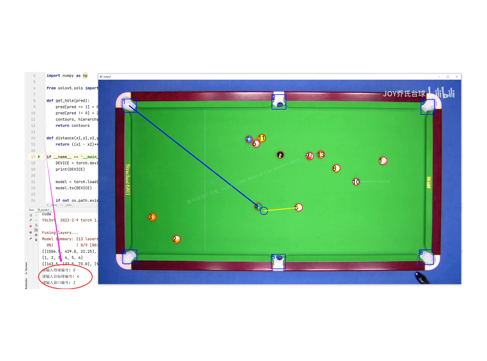
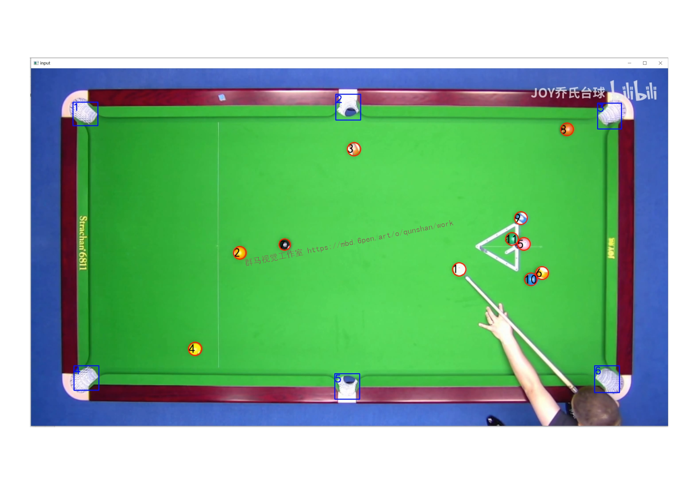
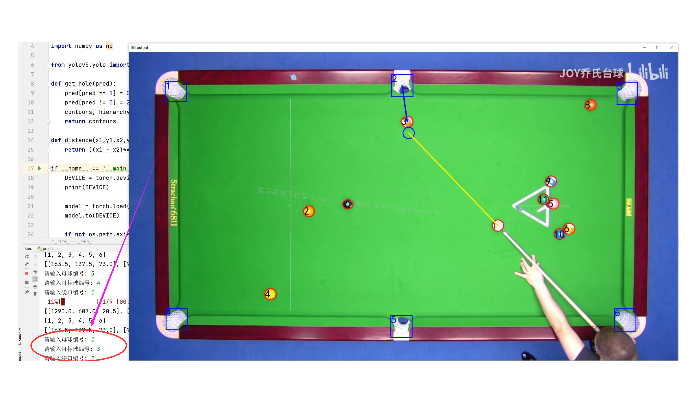
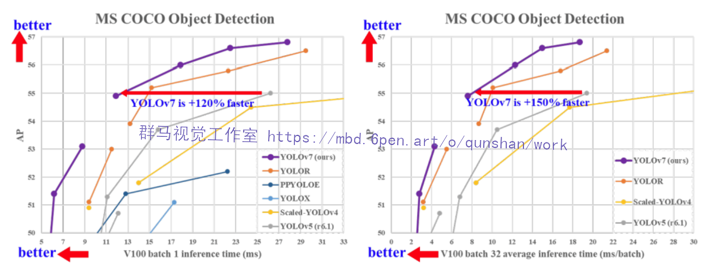
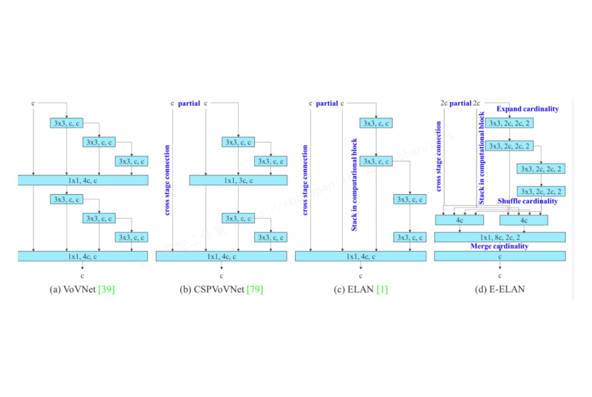
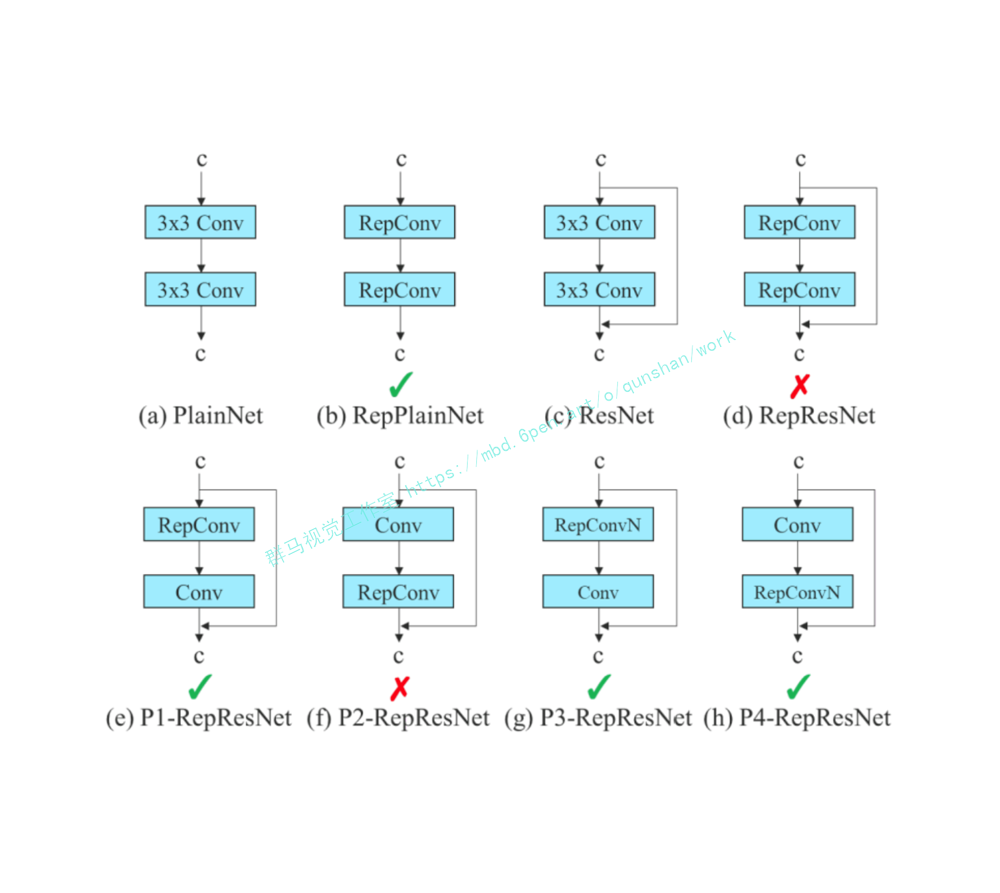
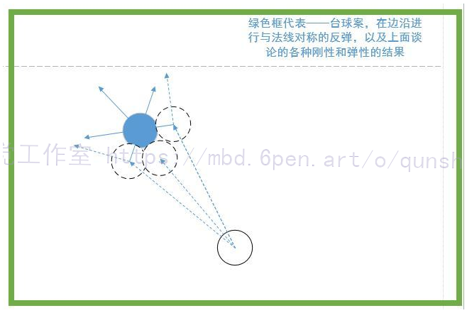
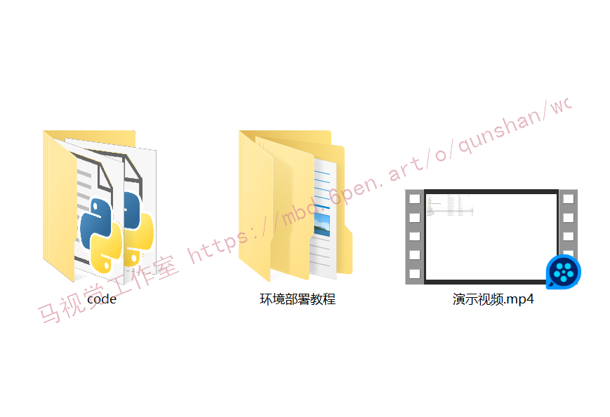

# 1.项目效果展示








# 2.视频演示

[Python基于OpenCV＆YOLO台球击球路线规划系统（源码＆部署教程）_哔哩哔哩_bilibili](https://www.bilibili.com/video/BV18t4y1776D/?vd_source=bc9aec86d164b67a7004b996143742dc)


# 3.YOLOv7算法简介
##  YOLOv7 在 5 FPS 到 160 FPS 范围内，速度和精度都超过了所有已知的目标检测器 
并在 [GPU](https://cloud.tencent.com/product/gpu?from=10680) V100 上，30 FPS 的情况下达到实时目标检测器的最高精度 56.8% AP。YOLOv7 是在 MS COCO 数据集上从头开始训练的，不使用任何其他数据集或预训练权重。
相对于其他类型的工具，YOLOv7-E6 目标检测器（56 FPS V100，55.9% AP）比基于 transformer 的检测器 SWINL Cascade-Mask R-CNN（9.2 FPS A100，53.9% AP）速度上高出 509%，精度高出 2%，比基于卷积的检测器 ConvNeXt-XL Cascade-Mask R-CNN (8.6 FPS A100, 55.2% AP) 速度高出 551%，精度高出 0.7%。


此外， YOLOv7 的在速度和精度上的表现也优于 YOLOR、YOLOX、Scaled-YOLOv4、YOLOv5、DETR 等多种目标检测器。

# 4.YOLOv7 技术方法
近年来，实时目标检测器仍在针对不同的边缘设备进行开发。例如，MCUNet 和 NanoDet 的开发专注于生产低功耗单芯片并提高边缘 CPU 的推理速度；YOLOX、YOLOR 等方法专注于提高各种 GPU 的推理速度；实时目标检测器的发展集中在高效架构的设计上；在 CPU 上使用的实时目标检测器的设计主要基于 MobileNet、ShuffleNet 或 GhostNet；为 GPU 开发的实时目标检测器则大多使用 ResNet、DarkNet 或 DLA，并使用 CSPNet 策略来优化架构。

YOLOv7 的发展方向与当前主流的实时目标检测器不同，研究团队希望它能够同时支持移动 GPU 和从边缘到云端的 GPU 设备。除了架构优化之外，该研究提出的方法还专注于训练过程的优化，将重点放在了一些优化模块和优化方法上。这可能会增加训练成本以提高目标检测的准确性，但不会增加推理成本。研究者将提出的模块和优化方法称为可训练的「bag-of-freebies」。

对于模型重参数化，该研究使用梯度传播路径的概念分析了适用于不同网络层的模型重参数化策略，并提出了有计划的重参数化模型。此外，研究者发现使用动态标签分配技术时，具有多个输出层的模型在训练时会产生新的问题：「如何为不同分支的输出分配动态目标？」针对这个问题，研究者提出了一种新的标签分配方法，称为从粗粒度到细粒度（coarse-to-fine）的引导式标签分配。

## 该研究的主要贡献包括：
[参考该博客提出的创新点](https://mbd.pub/o/bread/Y5WZlJ5p)
(1) 设计了几种可训练的 bag-of-freebies 方法，使得实时目标检测可以在不增加推理成本的情况下大大提高检测精度；

(2) 对于目标检测方法的演进，研究者发现了两个新问题：一是重参数化的模块如何替换原始模块，二是动态标签分配策略如何处理分配给不同输出层的问题，并提出了解决这两个问题的方法； 

(3) 提出了实时目标检测器的「扩充（extend）」和「复合扩展（compound scale）」方法，以有效地利用参数和计算； 

(4) 该研究提出的方法可以有效减少 SOTA 实时目标检测器约 40% 的参数和 50% 的计算量，并具有更快的推理速度和更高的检测精度。

在大多数关于设计高效架构的文献中，人们主要考虑的因素包括参数的数量、计算量和计算密度。下图 2（b）中 CSPVoVNet 的设计是 VoVNet 的变体。CSPVoVNet 的架构分析了梯度路径，以使不同层的权重能够学习更多不同的特征，使推理更快、更准确。图 2 (c) 中的 ELAN 则考虑了「如何设计一个高效网络」的问题。

YOLOv7 研究团队提出了基于 ELAN 的扩展 E-ELAN，其主要架构如图所示。

新的 E-ELAN 完全没有改变原有架构的梯度传输路径，其中使用组卷积来增加添加特征的基数（cardinality），并以 shuffle 和 merge cardinality 的方式组合不同组的特征。这种操作方式可以增强不同特征图学得的特征，改进参数的使用和计算效率。

无论梯度路径长度和大规模 ELAN 中计算块的堆叠数量如何，它都达到了稳定状态。如果无限堆叠更多的计算块，可能会破坏这种稳定状态，参数利用率会降低。新提出的 E-ELAN 使用 expand、shuffle、merge cardinality 在不破坏原有梯度路径的情况下让网络的学习能力不断增强。

在架构方面，E-ELAN 只改变了计算块的架构，而过渡层（transition layer）的架构完全没有改变。YOLOv7 的策略是使用组卷积来扩展计算块的通道和基数。研究者将对计算层的所有计算块应用相同的组参数和通道乘数。然后，每个计算块计算出的特征图会根据设置的组参数 g 被打乱成 g 个组，再将它们连接在一起。此时，每组特征图的通道数将与原始架构中的通道数相同。最后，该方法添加 g 组特征图来执行 merge cardinality。除了保持原有的 ELAN 设计架构，E-ELAN 还可以引导不同组的计算块学习更多样化的特征。
因此，对基于串联的模型，我们不能单独分析不同的扩展因子，而必须一起考虑。该研究提出图 （c），即在对基于级联的模型进行扩展时，只需要对计算块中的深度进行扩展，其余传输层进行相应的宽度扩展。这种复合扩展方法可以保持模型在初始设计时的特性和最佳结构。

此外，该研究使用梯度流传播路径来分析如何重参数化卷积，以与不同的网络相结合。下图展示了该研究设计的用于 PlainNet 和 ResNet 的「计划重参数化卷积」。


# 5.台球击球路线原理
[参考该博客提出的人工智能击球方案](https://afdian.net/item?plan_id=9313bf3c618a11ed96d952540025c377)
(1)球路的选定

　　台球的瞄准方法，是根据力的直线传递原理，通过主球撞击目标球，目标球被撞击后，便沿着直线进入球袋。因为球台上有6个球袋，分别固定在四角和边岸中部，而球是可以在球台上到处滚动的，要想把其中某一个球打进球袋，必须在球群中观察选择，哪个球的球路、角度最合适、容易进袋，在袋口附近有一个目标球，要想使这个球进袋，便要先看看球路是否合适，然后由球袋口中心，通过目标球中心，划一条直线，这条直线便是目标球进袋要走的路线。

(2)目标球上的击点

　　因为目标球没有外力推动本身是不能滚动的，必须通过主球的撞击才行。根据力的直线传递原理，要把某个目标球打进球袋，不能随便乱撞目标球上的任何点位，必须根据目标球的进袋线路，确定主球应该撞击目标球上的击点位置，才能完成打球入袋。
　　由目标球所对着的球袋中心，经过目标球中心延长线，这条线和目标球外圆相交在M点，这个点便是目标球上的击点。

(3)瞄准点

　　目标球上的击点确定之后，接着要确定瞄准点的位置。从目标球上的击点M，再沿这条直线向后，量出一段与球的半径相等的长度，最远点T就是瞄准点。以T点为圆心划一个圆形虚线，这个圆球形表示主球要撞击目标球必须来到的位置，主球与目标球的外圆才能在M点相交，与目标球相撞击，主球上的力量便通过M点传递给目标球，使它沿目标球球路入袋。


# 6.整合代码实现
```
import torch, cv2, os, tqdm
import numpy as np

import numpy as np

from yolov5.yolo import YOLOV5_Detect, opt

def get_hole(pred):
    pred[pred == 1] = 0
    pred[pred != 0] = 255
    contours, hierarchy = cv2.findContours(pred[:, :, 0], cv2.RETR_TREE, cv2.CHAIN_APPROX_SIMPLE)
    return contours

def distance(x1,y1,x2,y2):
    return ((x1 - x2)**2+(y1 - y2)**2)**0.5

if __name__ == '__main__':
    DEVICE = torch.device("cuda" if torch.cuda.is_available() else "cpu")
    print(DEVICE)

    model = torch.load('model.pkl')
    model.to(DEVICE)

    if not os.path.exists('output'):
        os.mkdir('output')

    path = 'detect'


    yolo_detect = YOLOV5_Detect(**vars(opt))

    for i in tqdm.tqdm(os.listdir(path)):
        # 读取图像
        ori_img = cv2.imdecode(np.fromfile('{}/{}'.format(path, i), np.uint8), cv2.IMREAD_COLOR)
        yolov5_res,balllist,ballvalue = yolo_detect.detect(ori_img)
        # 记录原图尺寸
        img_shape = ori_img.shape
        # Resize到训练大小 640*320
        img_ = cv2.resize(ori_img, (640, 320))
        # 转换通道 归一化
        img = np.transpose(np.expand_dims(img_, axis=0), (0, 3, 1, 2)) / 255.0
        # 转换成tensor格式
        img = torch.from_numpy(img).to(DEVICE).float()
        # 预测
        pred = np.argmax(model(img).cpu().detach().numpy()[0], axis=0)

        # 1 2 对应着目标类别
        pred_mask = []
        for j in pred.reshape((-1)):
            if j == 0:
                pred_mask.append(np.array([0, 0, 0]))
            elif j == 1:
                pred_mask.append(np.array([0, 0, 255]))
            elif j == 2:
                pred_mask.append(np.array([255, 0, 0]))
        pred_mask = np.array(pred_mask, dtype=np.uint8).reshape((pred.shape[0], pred.shape[1], 3))

        pred = np.expand_dims(pred, axis=-1)
        pred = np.repeat(pred, axis=-1, repeats=3)
        pred = np.array(pred, dtype=np.uint8)
        pred = cv2.resize(pred, (img_shape[1], img_shape[0]), interpolation=cv2.INTER_NEAREST)
        pred_mask = cv2.resize(pred_mask, (img_shape[1], img_shape[0]), interpolation=cv2.INTER_NEAREST)
        contours = get_hole(pred)

        pred[pred == 0] = 255
        pred[pred != 255] = 0
        yolov5_res = yolov5_res & pred
        # yolov5_res = cv2.addWeighted(yolov5_res, 0.5, pred_mask, 0.5, 0)
        # ori_img = yolov5_res & pred

        holes_coordinate = []
        radius = 0
        number = 0
        for cnts in contours:
            x, y, w, h = cv2.boundingRect(cnts)
            holes_coordinate.append([x, y, w, h])
            radius = radius + (w + h)/2
            number = number + 1
        holllist = []
        hollvalue = []
        holes_coordinate = sorted(holes_coordinate, key=lambda x:x[2] * x[3], reverse=True)[:6]
        holes_coordinate = sorted(holes_coordinate, key=lambda x:x[1])
        for idx, (x, y, w, h) in enumerate(sorted(holes_coordinate[:3], key=lambda x:x[0])):
            cv2.rectangle(yolov5_res, (x, y), (x + w, y + h), (255, 0, 0), 2)
            cv2.putText(yolov5_res, '{:.0f}'.format(idx + 1),
                        (x, y + 25), cv2.FONT_HERSHEY_SIMPLEX, 1.0,
                        (255, 0, 0), 2)
            holllist.append(idx + 1)
            hollvalue.append([x + w / 2, y + h / 2, (w + h) / 2])
            #print('hole {} x_center:{:.2f} y_center:{:.2f} radius:{:.2f}'.format(idx + 1, x + w / 2, y + h / 2, (w + h) / 2))

        for idx, (x, y, w, h) in enumerate(sorted(holes_coordinate[3:], key=lambda x:x[0])):
            cv2.rectangle(yolov5_res, (x, y), (x + w, y + h), (255, 0, 0), 2)
            cv2.putText(yolov5_res, '{:.0f}'.format(idx + 4),
                        (x, y + 25), cv2.FONT_HERSHEY_SIMPLEX, 1.0,
                        (255, 0, 0), 2)
            holllist.append(idx + 4)
            hollvalue.append([x + w / 2, y + h / 2, (w + h) / 2])
            #print('hole {} x_center:{:.2f} y_center:{:.2f} radius:{:.2f}'.format(idx + 4, x + w / 2, y + h / 2, (w + h) / 2))
        for m in range(len(balllist)):
            cv2.circle(yolov5_res, (int(ballvalue[m][0]),int(ballvalue[m][1])), int(ballvalue[m][2]), [0,0,255], 2)
        cv2.imshow('input', yolov5_res)
        cv2.waitKey(0)
        print(balllist)
        print(ballvalue)
        print(holllist)
        print(hollvalue)
        a = input("请输入母球编号: ")
        b = input("请输入目标球编号: ")
        c = input("请输入袋口编号: ")
        x1 = int(ballvalue[balllist.index(int(a))][0])
        y1 = int(ballvalue[balllist.index(int(a))][1])
        r1 = int(ballvalue[balllist.index(int(a))][2])
        x2 = int(ballvalue[balllist.index(int(b))][0])
        y2 = int(ballvalue[balllist.index(int(b))][1])
        r2 = int(ballvalue[balllist.index(int(b))][2])
        x3 = int(hollvalue[holllist.index(int(c))][0])
        y3 = int(hollvalue[holllist.index(int(c))][1])
        r3 = int(hollvalue[holllist.index(int(c))][2])
        #画出目标球的可能行进路线：
        def drawline(yolov5_res,x1,y1,x2,y2,r):
            gen = ((x2-x1)**2+(y2-y1)**2)**0.5
            x3 = int(x1 - (y2-y1)*r/gen)
            y3 = int(y1 + (x2-x1)*r/gen)
            x4 = int(x2 - (y2-y1)*r/gen)
            y4 = int(y2 + (x2-x1)*r/gen)
            x5 = int(x1 + (y2 - y1) * r / gen)
            y5 = int(y1 - (x2 - x1) * r / gen)
            x6 = int(x2 + (y2 - y1) * r / gen)
            y6 = int(y2 - (x2 - x1) * r / gen)
            cv2.line(yolov5_res, (x3, y3), (x4, y4), (255, 255, 255), 3)
            cv2.line(yolov5_res, (x5, y5), (x6, y6), (255, 255, 255), 3)
            return yolov5_res

        cv2.line(yolov5_res,(x2,y2),(x3,y3),(255, 0, 0),3)
        yolov5_res = drawline(yolov5_res,x2,y2,x3,y3,r2)
        #画出撞击点
        xz = int(x3 + (x2 - x3)*((r1+r2) + distance(x2,y2,x3,y3))/(distance(x2,y2,x3,y3)))
        yz = int(y3 + (y2 - y3)*((r1+r2) + distance(x2,y2,x3,y3))/(distance(x2,y2,x3,y3)))
        cv2.circle(yolov5_res, (xz,yz), int(ballvalue[balllist.index(int(a))][2]), [255, 0, 0], 2)
        #画出母球的行进路线
        cv2.line(yolov5_res, (xz, yz), (x1, y1), (255, 0, 0), 3)
        yolov5_res = drawline(yolov5_res, xz, yz, x1, y1,r1)
        cv2.imshow('output',yolov5_res)
        cv2.waitKey(0)

        #cv2.imwrite('output/{}'.format(i), yolov5_res)
```

# 7.系统整合
完整[源码&环境部署视频教程](https://zhuanlan.zhihu.com/p/561935957)

参考博客[《Python基于OpenCV＆YOLO台球击球路线规划系统（源码＆部署教程）》](https://mbd.pub/o/qunma/work)


---
#### 如果您需要更详细的【源码和环境部署教程】，除了通过【系统整合】小节的链接获取之外，还可以通过邮箱以下途径获取:
#### 1.请先在GitHub上为该项目点赞（Star），编辑一封邮件，附上点赞的截图、项目的中文描述概述（About）以及您的用途需求，发送到我们的邮箱
#### sharecode@yeah.net
#### 2.我们收到邮件后会定期根据邮件的接收顺序将【完整源码和环境部署教程】发送到您的邮箱。
#### 【免责声明】本文来源于用户投稿，如果侵犯任何第三方的合法权益，可通过邮箱联系删除。